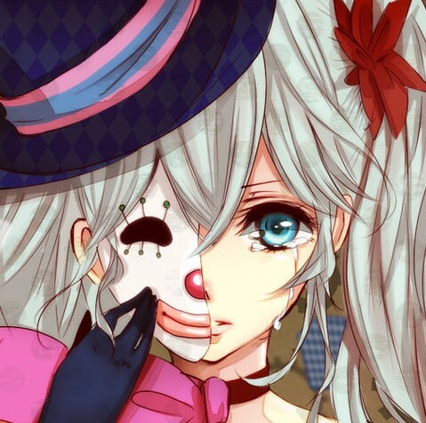

进入<a href="{{ site.baseurl }}/menzi/html/menzi.html">**尿兜聊天模拟器**</a>

[TOC]

-------------

####闷子

闷子,是我的朋友;
此人沉默寡言,思维迟钝;
写这个聊天模拟器最初的想法,就是因为闷子;
认识闷子,也有一年多了,和她聊天的时候,她说的最多的就这么几句:

> 什么心态
> 。。。
> 额
> 你才xxx
> 这。。。。
> 囧
> 枕头受
> 2

是在是无聊透了,是吧;
但是那时候我的好友列表里能叫的动的也就只有闷子了;
后来我想,不如弄一个程序,把这几句话存到文件里,随机显示,不就跟闷子一样了么;
顺便还能练一下js和css;
但是在学校的时候比较懒,就搁置了;
一搁置,就搁置到了现在;
这几天在公司闲着没事儿,想起来这茬,就开始做了----闷子模拟器诞生;
只有个闷子,太单调了,要不,再加几个人吧----陪聊列表;

####尿兜

尿兜,全称**一号尿兜**;
是一个YY频道的子频道;
曾几何时,那里也是挺热闹的;
一群逗比聚拢在那里谈天(B)说地(L);
后来,也没落了;
陪聊列表里的角色,都是来自尿兜;

####人物设定

待续

####**html**,**js**和**css**

一直想好好研究研究`js`和`css`,每次一开始看就脑袋疼;
这次一定好好研究研究;

 | 人物| 特征| 参数|状态|
 | :-------| :---- | :--- |:----|
 | 周闷子|  |      |可用|
 | 玉扃|   |   |可用|
 | 乌鸦|    |   |可用|
 |2TO|  |  |可用|
 |丁丁| | |调教中|
 |贝勒| | |调教中|
 |贱龙| | |调教中|
 |磊子| | |调教中|
 |凌风| | |调教中|
 |安紫| | |调教中|
 |丁丁| | |调教中|
 |`更多`| | |待开发|

---

> 待解决的bug
> 
> - bug1
> - bug2

---

>待添加的功能
>
> - 功能1
> - 功能2

---
就酱

